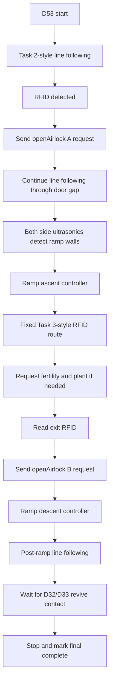
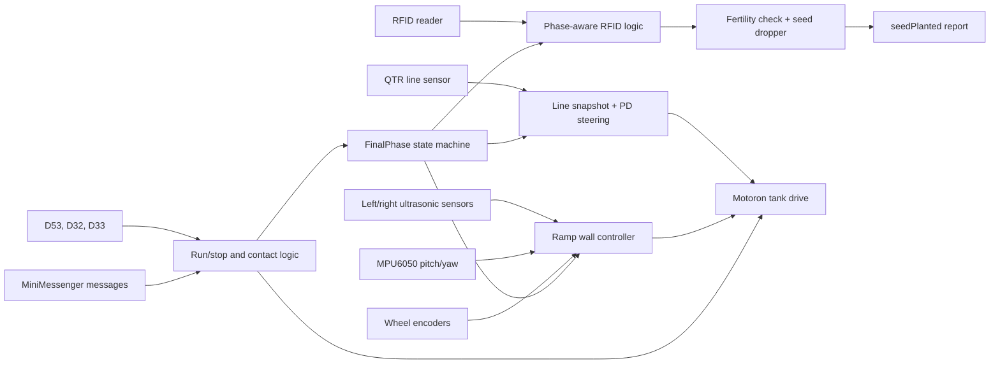
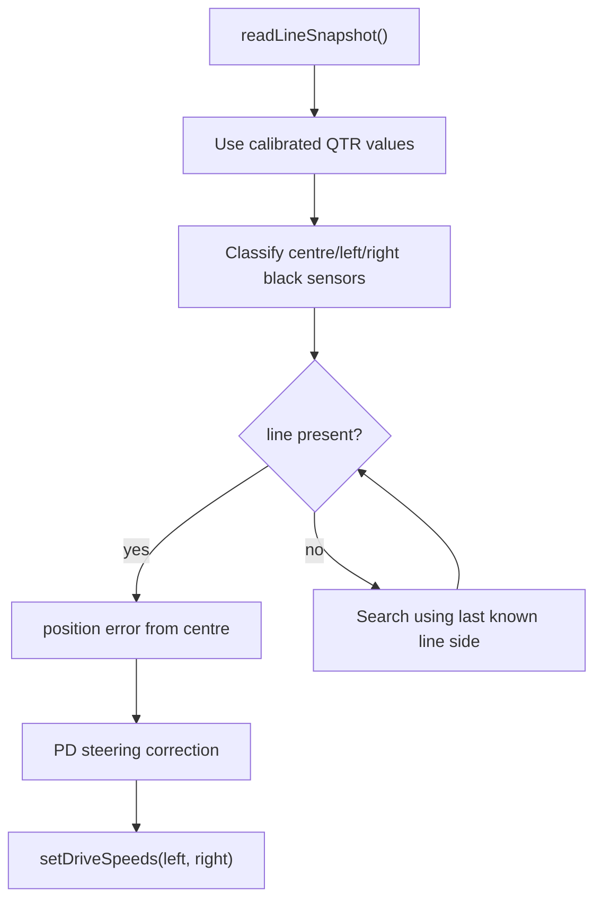
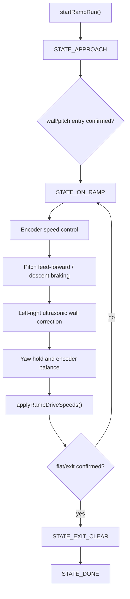
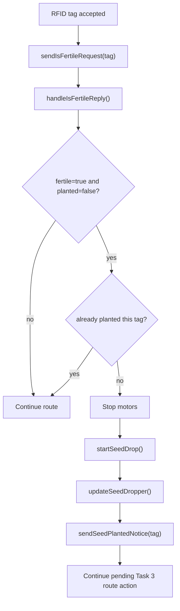
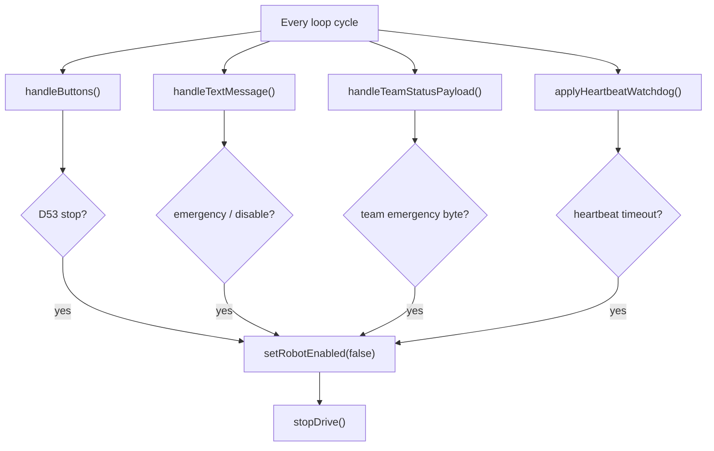

# Term3Project - Final Easy Robot Controller

This repository's final submission sketch is:

- `final_easy/final_easy.ino`

The other sketch folders are development history and are not required for the Final Easy upload.

## Final Easy Behaviour

`final_easy/final_easy.ino` is the source of truth for the Easy final run. It combines:

- Task 2-style line following to Airlock A.
- RFID detection and `openAirlock` request for Airlock A.
- Line following through the airlock exit gap.
- Ramp ascent using encoder, IMU, and side-ultrasonic feedback.
- Fixed Task 3-style RFID navigation and planting.
- Airlock B request using the exit RFID.
- Ramp descent.
- Final line following and D32/D33 revive-contact stop.
- D53 physical run/stop priority.
- Server emergency, disable, heartbeat, and team-status safety handling.

## Setup and Upload

1. Open `final_easy/final_easy.ino` in Arduino IDE.
2. Install/select the Arduino GIGA R1 board support package.
3. Install the required libraries:
   - `Motoron`
   - `MFRC522_I2C`
   - `MiniMessenger`
   - `Servo`
4. Create a local `final_easy/secrets.h` with the WiFi, broker, and group settings used by the competition server.
5. Connect the Arduino GIGA R1 and upload `final_easy/final_easy.ino`.
6. Open Serial Monitor at `115200` baud.
7. Keep the wheels lifted for the first motor test.

`secrets.h` is ignored by git so private WiFi and broker details are not committed.

## Serial Monitor Commands

| Command / input | Function |
| --- | --- |
| D53 press | Start/resume when idle, or stop when running. This is the only physical run/stop switch. |
| D32 / D33 press | Revive/contact inputs only. They do not start the robot. |
| `w` | Short forward bench test from `IDLE` or `COMPLETE`. Keep wheels lifted for the first test. |
| `x` | Stop bench test or idle motors. |
| `l`, `load`, `plant load` | Add one seed to the software count after physically loading the dropper. |
| `r`, `plant reset` | Reset seed count and treat the current servo position as the loaded position. |
| `p` | Print final phase and dropper status. |
| `h`, `?` | Print command help. |

## Final Easy Flow

## Software Overview

## Main Code Structure

| Area | Main code names |
| --- | --- |
| Mission phases | `FinalPhase`, `enterFinalPhase()`, `updateFinalAutomation()` |
| Line following | `LineSnapshot`, `readLineSnapshot()`, `updateTask2ToAirlock()`, `updateLineToRamp()`, `updatePostRampLine()` |
| RFID decisions | `handleRfidScan()`, `handleFinalRfidTag()` |
| Planting | `sendIsFertileRequest()`, `handleIsFertileReply()`, `updateTask3Automation()` |
| Seed dropper | `startSeedDrop()`, `updateSeedDropper()`, `sendPendingSeedPlantedIfNeeded()` |
| Ramp | `RampState`, `startRampRun()`, `updateRampStateMachine()` |
| Safety | `handleButtons()`, `handleTextMessage()`, `handleTeamStatusPayload()`, `applyHeartbeatWatchdog()` |

The main `loop()` is a scheduler. It updates messaging, the dropper, safety checks, buttons, serial input, encoders, IMU, ultrasonic sensors, RFID, final automation, motor output, LEDs, and status printing every cycle.

## Algorithm Evidence

### Line Following

The QTR sensor is calibrated on startup. The robot calculates a weighted line position and applies proportional/derivative steering. Junction and turn detection use repeated frame confirmation so one noisy reading does not immediately change state.

### Ramp Control

The ramp controller combines encoder speed, IMU pitch, IMU yaw, and left/right ultrasonic distance equality. Entry and exit use confirmation counters rather than single readings.

### Planting

The seed dropper is non-blocking, so safety checks and server messages continue while the servo is moving. Duplicate planted tags are skipped.

### Safety Priority

D53, server emergency/disable messages, heartbeat timeout, and team-status emergency all stop the robot regardless of the current mission phase.

## Required Hardware Map

| Hardware | Pins / bus |
| --- | --- |
| Left Motoron | `Wire1`, address `0x10` |
| Right Motoron | `Wire1`, address `0x11` |
| RFID reader | `Wire1`, address `0x28` |
| MPU6050 | `Wire`, address `0x68`, `D20=SDA`, `D21=SCL` |
| QTR 9-channel sensor | `D22` to `D30`, emitter `D31` |
| Front HC-SR04 | `trig=D37`, `echo=D36` |
| Left HC-SR04 | `trig=D41`, `echo=D40` |
| Right HC-SR04 | `trig=D39`, `echo=D38` |
| Encoders | RB `D42/D43`, LB `D44/D45`, RF `D48/D49`, LF `D50/D51` |
| Seed/dropper servo | `D47` |
| Buttons / LEDs | Revive/contact `D32`, auxiliary contact `D33`, run/stop `D53`, red LED `D34`, green LED `D35` |

## Testing Evidence To Record

Add real test evidence before final submission. Useful evidence includes:

| Area | Evidence to capture |
| --- | --- |
| QTR line tracking | Calibration values or Serial Monitor snapshot, plus a short line-following run video. |
| Motor direction | Wheel-lift test showing all wheels move forward for positive robot-forward command. |
| Encoders | Counts increasing during forward motion for all four wheels. |
| IMU | Flat pitch/roll near zero and known turn/yaw response. |
| RFID and airlocks | UID log plus `openAirlock` request/reply log for Airlock A and B. |
| Planting | `isFertileReply`, seed drop, and `seedPlanted` report log. |
| Ramp | Short ascent/descent log showing pitch, wall distances, and encoder movement. |
| Safety | D53 stop test or server emergency/heartbeat timeout stop log. |
