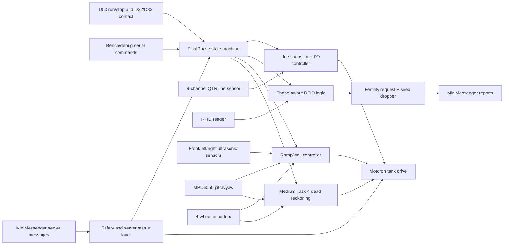
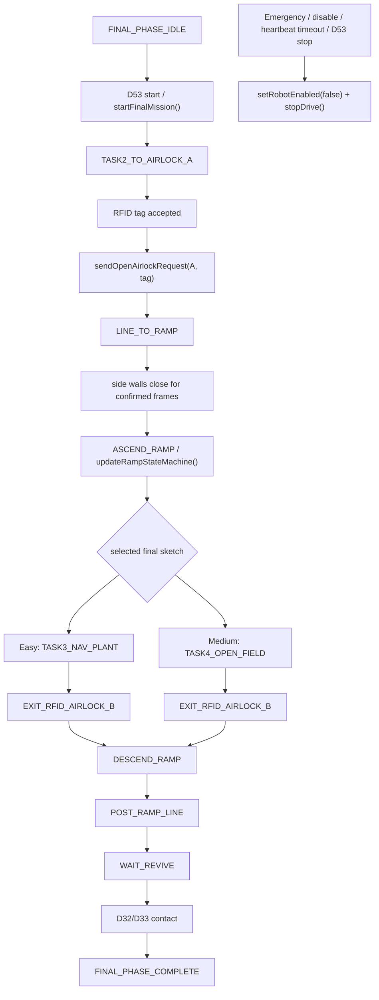
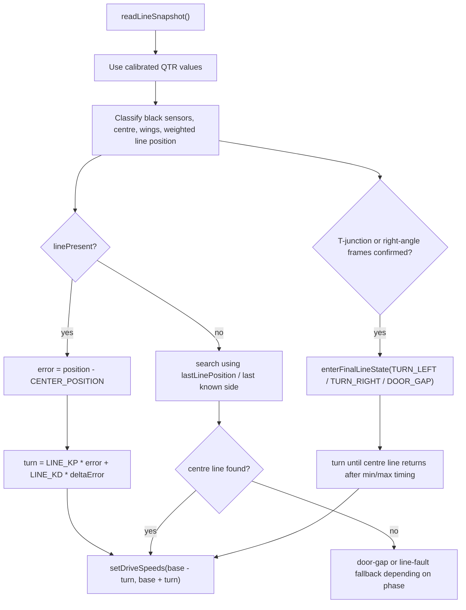
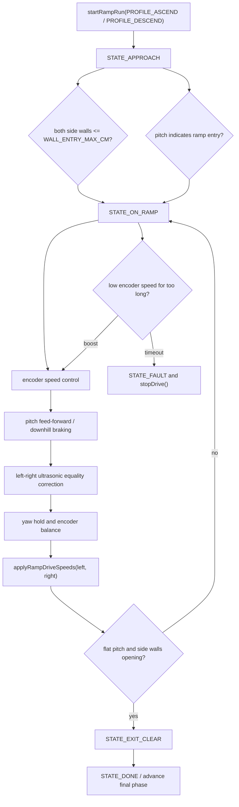
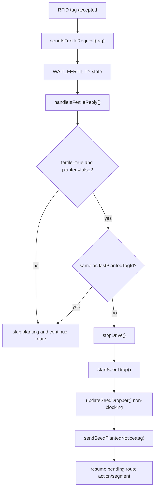
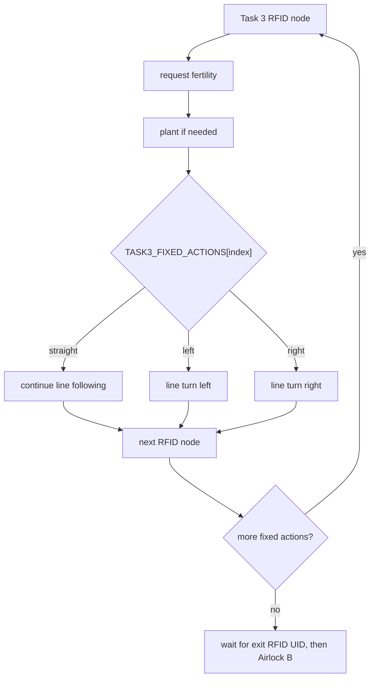
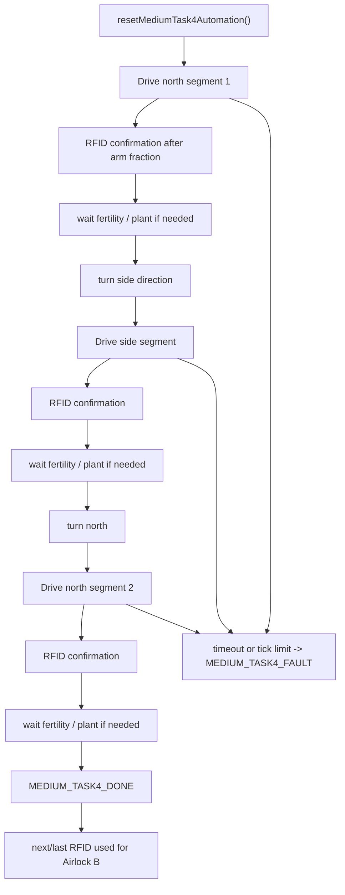
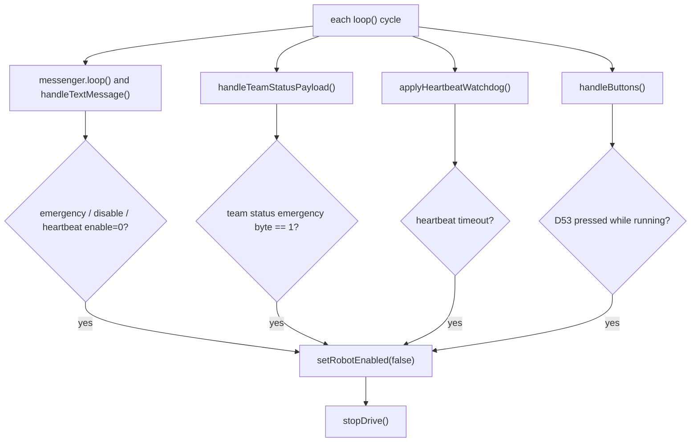

# Algorithm Evidence for Final Submission

This document explains the algorithms used by the final robot sketches and maps the diagrams directly to the implemented code. The two final source-of-truth sketches are:

- `final_easy/final_easy.ino` - Easy final route: Task 2 line/RFID entry, ramp ascent/descent, fixed Task 3-style navigation and planting, final revive contact.
- `final_medium/final_medium.ino` - Medium final route: same entry/ramp shell, then a Task 4-style open-field staircase with RFID confirmation and planting decisions.

The final code is intentionally organised as Arduino sketches with named state machines, constants, helper functions, and short scheduler-style `loop()` functions. The main algorithms below refer to the function and enum names in the sketches so the implementation can be checked from the diagrams.

## Implementation Map

| Behaviour / concern | Easy implementation | Medium implementation | Evidence in code |
| --- | --- | --- | --- |
| Top-level mission phases | `FinalPhase`, `enterFinalPhase()`, `updateFinalAutomation()` | `FinalPhase`, `enterFinalPhase()`, `updateFinalAutomation()` | Explicit phase enum and one central phase dispatcher. |
| Physical start/stop and revive contact | `handleButtons()`, `handleReviveContact()` | `handleButtons()`, `handleReviveContact()` | D53 toggles run/stop; D32/D33 are revive/contact inputs only. |
| Server emergency / heartbeat safety | `handleTextMessage()`, `handleTeamStatusPayload()`, `applyHeartbeatWatchdog()` | Same function names | Emergency, disable, heartbeat timeout, and team-status emergency all stop the robot. |
| Line following and junction handling | `LineSnapshot`, `readLineSnapshot()`, `updateTask2ToAirlock()`, `updateLineToRamp()`, `updatePostRampLine()` | Same function names | QTR readings are calibrated, classified, and used by a PD steering controller plus line-state detection. |
| RFID handling | `handleRfidScan()`, `handleFinalRfidTag()` | Same function names plus `handleMediumTask4Rfid()` | Repeated tags are filtered; accepted tags trigger phase-specific decisions. |
| Planting decision | `sendIsFertileRequest()`, `handleIsFertileReply()`, `updateTask3Automation()` | `sendIsFertileRequest()`, `handleIsFertileReply()`, `updateMediumTask4Automation()` | Planting happens only after a fertile/unplanted reply and duplicate tags are skipped. |
| Seed/dropper actuation | `startSeedDrop()`, `updateSeedDropper()`, `sendPendingSeedPlantedIfNeeded()` | Same function names | Dropper is non-blocking and seed-planted messages are retried if needed. |
| Ramp ascent/descent | `RampState`, `startRampRun()`, `updateRampStateMachine()` | Same function names | Uses encoders, IMU pitch/yaw, and side ultrasonic wall equality. |
| Medium open-field route | Not used in final Easy | `MediumTask4State`, `updateMediumTask4Automation()` | Encoder/IMU segment driving, RFID node confirmation, turn states, and fertility wait states. |

## Software Overview

The main `loop()` in both final sketches is a scheduler. It repeatedly updates messaging, seed-dropper motion, safety checks, buttons, serial commands, encoders, IMU, ultrasonic sensors, RFID, final automation, motor output, LEDs, and status printing. This keeps the robot responsive instead of hiding the mission inside one blocking routine.

## Top-Level Final Phase Algorithm

The final phase enum is the high-level mission contract. Each phase owns only the behaviour that should run in that part of the course, and `updateFinalAutomation()` dispatches to the correct updater. Safety checks are deliberately outside the phase path so they can stop the robot regardless of the current mission phase.

## Line Following and RFID Entry Algorithm

The line algorithm uses calibrated RC timing values from the QTR sensors. A weighted average gives the line position, while black-sensor counts on the left, middle, and right detect junctions, turns, and door gaps. Steering uses proportional and derivative terms, with turn output constrained by constants near the top of the sketch.

For Task 2 entry, RFID detection during line following triggers an Airlock A request. After the door area, the code allows a short straight drive through a possible line gap before ramp-wall detection takes over.

## Ramp Ascent and Descent Algorithm

The ramp controller combines four feedback signals:

- Encoder speed controls the basic forward command.
- IMU pitch adds climb feed-forward on ascent and braking on descent.
- IMU yaw helps hold the entry heading.
- Left/right ultrasonic readings keep the robot centred between ramp walls by reducing the distance difference.

The ramp state machine uses confirmation-frame counters rather than one-off sensor readings, so noisy pitch or ultrasonic samples do not immediately change state.

## Planting and Fertility Algorithm

The planting logic separates the navigation decision from the servo movement. RFID creates a server request, the reply decides whether planting is necessary, and the dropper runs as a non-blocking state machine. This prevents a seed drop from freezing safety checks, server messages, or encoder/IMU updates.

## Easy Fixed Route Algorithm

Easy mode uses a fixed Task 3-style route array, so the behaviour is repeatable and can be checked against `TASK3_FIXED_ACTIONS`. RFID nodes pause the route, request fertility, optionally plant, then perform the next route action.

## Medium Open-Field Algorithm

Medium mode uses encoder ticks to drive cell-length segments and IMU yaw to hold direction. RFID is used as a checkpoint after the robot has travelled far enough into a segment, preventing the code from accepting an old tag too early. Each confirmed node can trigger a fertility request and optional seed drop before the next segment or turn.

The main tuning constants are grouped near the top of `final_medium/final_medium.ino`:

- `MEDIUM_TASK4_NORTH_1`
- `MEDIUM_TASK4_SIDE_NODES`
- `MEDIUM_TASK4_NORTH_2`
- `MEDIUM_TASK4_SIDE_TURN_RIGHT`
- `MEDIUM_TASK4_CELL_TICKS`
- `MEDIUM_TASK4_CELL_TICK_LIMIT`
- `MEDIUM_TASK4_RFID_ARM_FRACTION`

## Safety Priority Evidence

Safety is checked every main-loop cycle and is not hidden inside the route code. The robot can stop from:

- D53 physical run/stop switch.
- Server `emergency` or `disable` messages.
- Server heartbeat disabling motion.
- Missing heartbeat after `HEARTBEAT_TIMEOUT_MS`.
- Six-byte team-status emergency flag.

## Calibration and Test Evidence To Attach

This repository now contains the algorithm explanation and code-to-flowchart mapping. For the final offline review and viva, add real test evidence in `README.md` or a separate `docs/test_evidence.md` file. Do not fabricate values; use actual Serial Monitor output, photos, screenshots, or video links.

| Evidence area | Suggested evidence | Relevant code |
| --- | --- | --- |
| QTR line calibration | Serial output or photo showing calibration run and line-following result. | `runQTRCalibration()`, `readLineSnapshot()` |
| RFID and airlock request | UID log and server request/reply log for Airlock A/B. | `handleRfidScan()`, `sendOpenAirlockRequest()` |
| Fertility and planting | One fertile/unplanted reply followed by seed drop and `seedPlanted` report. | `handleIsFertileReply()`, `startSeedDrop()`, `sendSeedPlantedNotice()` |
| Ramp control | Short ascent/descent log with pitch, wall readings, and encoder movement. | `updateRampStateMachine()`, `applyRampDrive()` |
| Kill/emergency handling | D53 stop test or server emergency/heartbeat stop log. | `handleButtons()`, `applyHeartbeatWatchdog()` |
| Medium Task 4 route | Segment tick counts and RFID confirmations at open-field nodes. | `updateMediumTask4Automation()` |

